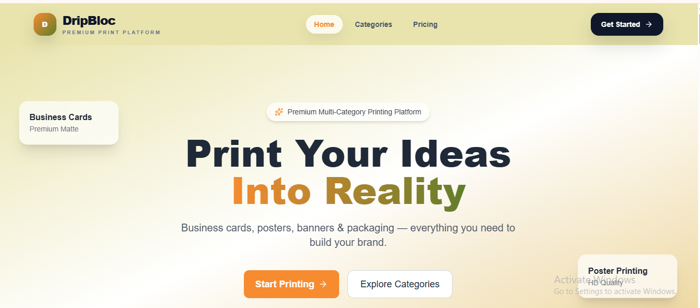
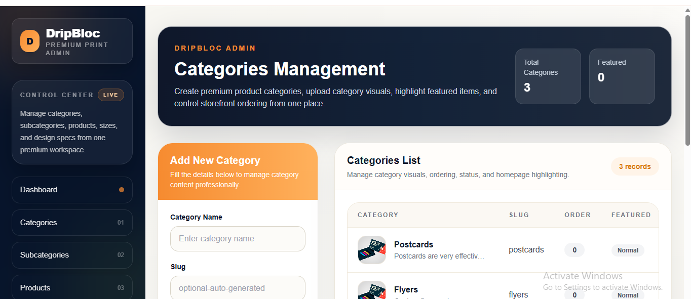
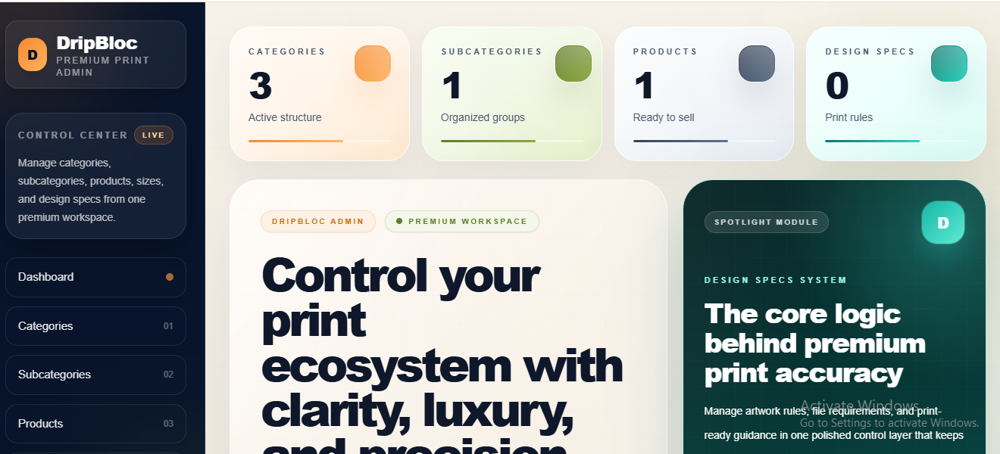
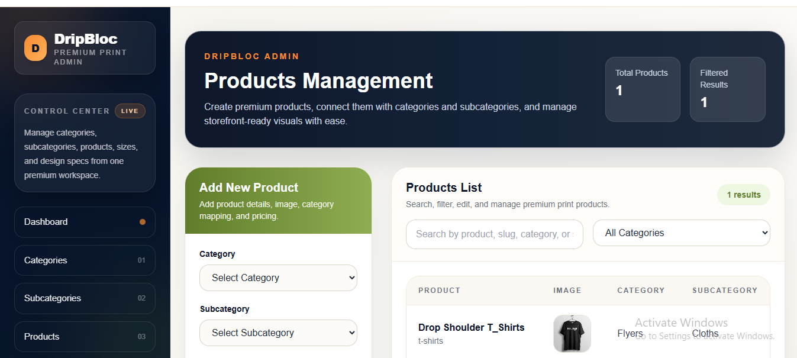

# 🚀 DripBloc

> Premium multi-category printing SaaS built with Laravel + React

DripBloc is a modern **category-driven printing platform** designed for businesses that want a premium online ordering experience for custom print products.

Instead of treating products as simple listings, DripBloc builds **configurable category systems** — where each category has its own sizes, design specs, templates, and purchase flow.

---

## ✨ Product Preview

### 🏠 Homepage


### 🧩 Category Experience


### 📊 Admin Dashboard


### ⚙️ Product Configuration Flow


---

## 🧠 Overview

DripBloc is not a basic e-commerce store.

It is a **scalable SaaS architecture** where:

- Categories = Entry layer
- Subcategories = Structure
- Products = Execution layer
- Sizes = Flexible configuration
- Design Specs = Production rules

---

## 🔥 Key Features

- Premium modern UI (SaaS style)
- Category-first architecture (not product-first)
- Dynamic category pages
- Flexible size system (standard + dimension-based)
- Design specification system
- Template / artwork guide support
- Laravel MVC backend
- React-powered frontend
- Admin panel for full control

---

## 💎 Why This Project Stands Out

Most printing platforms are basic catalogs.

DripBloc is different because it focuses on:

- structured printing workflows
- scalable category systems
- real-world printing logic
- SaaS-ready architecture

---

## 🛠 Tech Stack

**Backend**
- Laravel
- PHP
- MVC Architecture
- REST APIs

**Frontend**
- React JS
- Tailwind CSS
- Vite
- Framer Motion
- Lucide Icons

**Database**
- MySQL / SQLite

---

## 🧩 Core Modules

### Customer Side
- Homepage (category-first UI)
- Category pages
- Product detail page
- Size selection flow
- Design upload / guidance

### Admin Side
- Category management
- Subcategory management
- Product management
- Category size system
- Design specs system

---

## 🏗 Architecture

```text
Category
 ├── Subcategories
 ├── Products
 ├── Sizes
 ├── Design Specs
 └── Templates / Downloads
